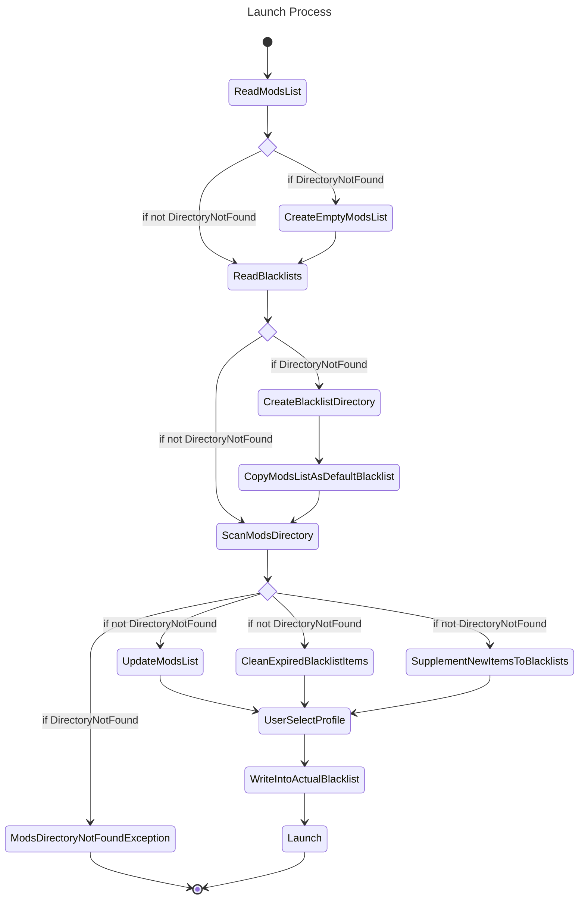
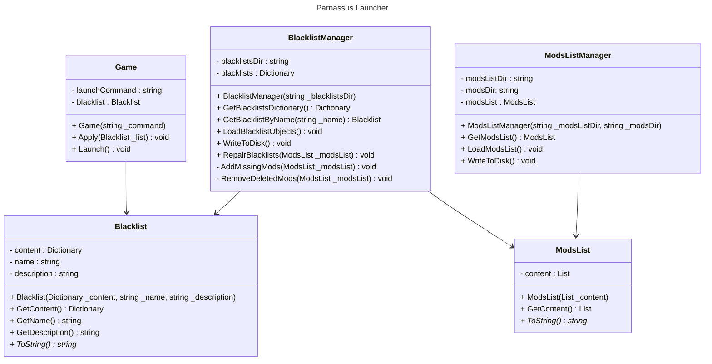

# Parnassus Launcher Draft

## Launcher

```mermaid
---
title: Launch Process
---
stateDiagram-v2
    state CheckModsListDirectory <<choice>>
    state CheckBlacklistDirectory <<choice>>
    state CheckModsDirectory <<choice>>
    [*] --> ReadModsList
    ReadModsList --> CheckModsListDirectory
    CheckModsListDirectory --> ReadBlacklists: if not DirectoryNotFound
    CheckModsListDirectory --> CreateEmptyModsList: if DirectoryNotFound
    CreateEmptyModsList --> ReadBlacklists
    ReadBlacklists --> CheckBlacklistDirectory
    CheckBlacklistDirectory --> ScanModsDirectory: if not DirectoryNotFound
    CheckBlacklistDirectory --> CreateBlacklistDirectory: if DirectoryNotFound
    CreateBlacklistDirectory --> CopyModsListAsDefaultBlacklist
    CopyModsListAsDefaultBlacklist --> ScanModsDirectory
    ScanModsDirectory --> CheckModsDirectory
    CheckModsDirectory --> ModsDirectoryNotFoundException: if DirectoryNotFound
    ModsDirectoryNotFoundException --> [*]
    CheckModsDirectory --> UpdateModsList: if not DirectoryNotFound
    CheckModsDirectory --> CleanExpiredBlacklistItems: if not DirectoryNotFound
    CheckModsDirectory --> SupplementNewItemsToBlacklists: if not DirectoryNotFound
    UpdateModsList --> UserSelectProfile
    CleanExpiredBlacklistItems --> UserSelectProfile
    SupplementNewItemsToBlacklists --> UserSelectProfile
    UserSelectProfile --> WriteIntoActualBlacklist
    WriteIntoActualBlacklist --> Launch
    Launch --> [*]
```

### Launcher Data Structures

* Game

```mermaid
---
title: Parnassus.Launcher
---
classDiagram
    class Game {
        - launchCommand : string
        - blacklist : Blacklist
        + Game(string _command)
        + Apply(Blacklist _list) void
        + Launch() void
    }

    class Blacklist {
        - content : Dictionary
        - name : string
        - description : string
        + Blacklist(Dictionary _content, string _name, string _description)
        + GetContent() Dictionary
        + GetName() string
        + GetDescription() string
        + ToString() string*
    }

    class BlacklistManager {
        - blacklistsDir : string
        - blacklists : Dictionary
        + BlacklistManager(string _blacklistsDir)
        + GetBlacklistsDictionary() Dictionary
        + GetBlacklistByName(string _name) Blacklist
        + LoadBlacklistObjects() void
        + WriteToDisk() void
        + RepairBlacklists(ModsList _modsList) void
        - AddMissingMods(ModsList _modsList) void
        - RemoveDeletedMods(ModsList _modsList) void
    }

    class ModsList {
        - content : List
        + ModsList(List _content)
        + GetContent() List
        + ToString() string*
    }

    class ModsListManager {
        - modsListDir : string
        - modsDir: string
        - modsList : ModsList
        + ModsListManager(string _modsListDir, string _modsDir)
        + GetModsList() ModsList
        + LoadModsList() void
        + WriteToDisk() void
    }

    BlacklistManager --> Blacklist
    BlacklistManager --> ModsList
    ModsListManager --> ModsList
    Game --> Blacklist
```