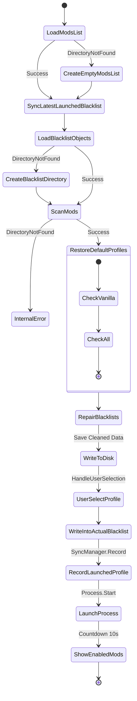
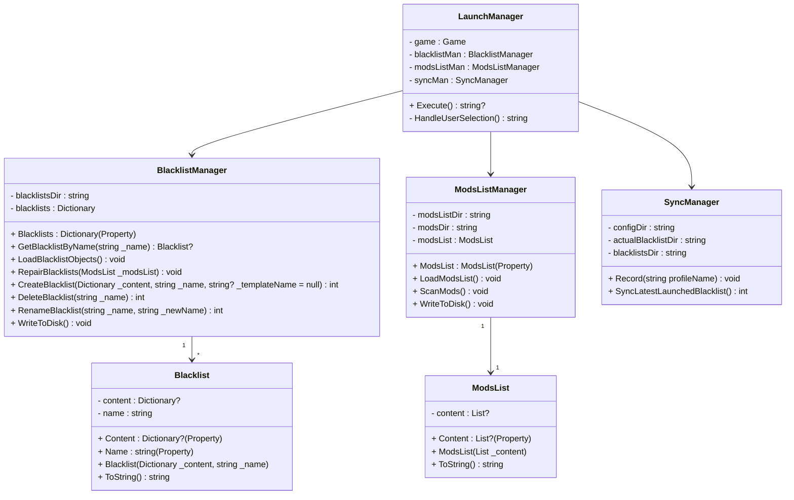

# Parnassus Launcher Draft

## Launch Process

```mermaid
stateDiagram-v2
    [*] --> LoadModsList
    LoadModsList --> CreateEmptyModsList: DirectoryNotFound
    LoadModsList --> SyncLatestLaunchedBlacklist: Success
    CreateEmptyModsList --> SyncLatestLaunchedBlacklist
    
    SyncLatestLaunchedBlacklist --> LoadBlacklistObjects
    LoadBlacklistObjects --> CreateBlacklistDirectory: DirectoryNotFound
    CreateBlacklistDirectory --> ScanMods
    LoadBlacklistObjects --> ScanMods: Success
    
    ScanMods --> InternalError: DirectoryNotFound
    ScanMods --> RestoreDefaultProfiles: Success
    
    state RestoreDefaultProfiles {
        [*] --> CheckVanilla
        CheckVanilla --> CheckAll
        CheckAll --> [*]
    }
    
    RestoreDefaultProfiles --> RepairBlacklists
    RepairBlacklists --> WriteToDisk: Save Cleaned Data
    WriteToDisk --> UserSelectProfile: HandleUserSelection
    
    UserSelectProfile --> WriteIntoActualBlacklist
    WriteIntoActualBlacklist --> RecordLaunchedProfile: SyncManager.Record
    RecordLaunchedProfile --> LaunchProcess: Process.Start
    LaunchProcess --> ShowEnabledMods: Countdown 10s
    ShowEnabledMods --> [*]
```

## Launcher UML

```mermaid
classDiagram
    class Blacklist {
        - content : Dictionary<string, bool>?
        - name : string
        + Content : Dictionary<string, bool>? (Property)
        + Name : string (Property)
        + Blacklist(Dictionary _content, string _name)
        + ToString() string
    }

    class BlacklistManager {
        - blacklistsDir : string
        - blacklists : Dictionary<string, Blacklist?>
        + Blacklists : Dictionary<string, Blacklist?> (Property)
        + GetBlacklistByName(string _name) Blacklist?
        + LoadBlacklistObjects() void
        + RepairBlacklists(ModsList _modsList) void
        + CreateBlacklist(Dictionary _content, string _name, string? _templateName = null) int
        + DeleteBlacklist(string _name) int
        + RenameBlacklist(string _name, string _newName) int
        + WriteToDisk() void
    }

    class ModsList {
        - content : List<string>?
        + Content : List<string>? (Property)
        + ModsList(List _content)
        + ToString() string
    }

    class ModsListManager {
        - modsListDir : string
        - modsDir : string
        - modsList : ModsList
        + ModsList : ModsList (Property)
        + LoadModsList() void
        + ScanMods() void
        + WriteToDisk() void
    }

    class SyncManager {
        - configDir : string
        - actualBlacklistDir : string
        - blacklistsDir : string
        + Record(string profileName) void
        + SyncLatestLaunchedBlacklist() int
    }

    class LaunchManager {
        - game : Game
        - blacklistMan : BlacklistManager
        - modsListMan : ModsListManager
        - syncMan : SyncManager
        + Execute() string?
        - HandleUserSelection() string
    }

    BlacklistManager "1" --> "*" Blacklist
    ModsListManager "1" --> "1" ModsList
    LaunchManager --> BlacklistManager
    LaunchManager --> ModsListManager
    LaunchManager --> SyncManager
```